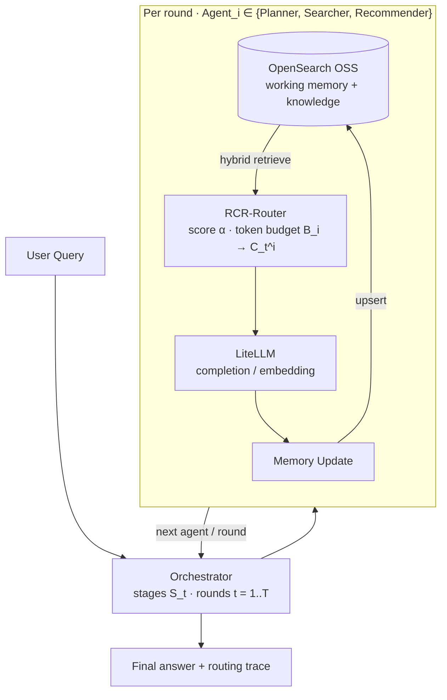

# Cloudera Blueprint: RCR — Role-Based Agent Routing

[](LICENSE)
[](pyproject.toml)
[](METADATA.yaml)
[-6b4cff.svg)](METADATA.yaml)
[](https://github.com/BrooksIan/RCREfficientRouting/stargazers)
[](https://github.com/BrooksIan/RCREfficientRouting/watchers)
[](https://github.com/BrooksIan/RCREfficientRouting/network/members)

> This repository follows the [Cloudera Blueprints Standard](https://github.com/kevinbtalbert/Cloudera-Blueprints-Standard) for catalog-facing content (`README.md`, `METADATA.yaml`) and the [CML Community AMP Template](https://github.com/cloudera/CML_Community_AMP_Template) for launchable AMP structure (`.project-metadata.yaml`, numbered CML component folders, `cdsw-build.sh`).

**RCR** (*Role-aware Context Routing*) sends each agent only the memory slice that matters for its role and stage—under a token budget—instead of the full shared history. Implementation follows [RCR-Router (arXiv:2508.04903v3 §2)](https://arxiv.org/html/2508.04903v3#Sx2). Shared memory and semantic knowledge live in **OpenSearch OSS**. All LLM and embedding calls go through **LiteLLM**.

## Table of Contents

- [Overview](#overview)
- [Demo](#demo)
- [Use Case](#use-case)
- [Key Features](#key-features)
- [Quickstart](#quickstart--guide)
- [Architecture / Software Components](#architecture--software-components)
- [Target Audience](#target-audience)
- [Repository Structure](#repository-structure)
- [Prerequisites](#prerequisites)
- [Hardware Requirements](#hardware-requirements)
- [Documentation](#documentation)

## Overview

**RCR — Role-Based Agent Routing** is a Cloudera Machine Learning Applied ML Prototype (AMP) that runs a multi-agent workflow (Planner, Searcher, Recommender) with **role-aware, token-budgeted context routing**. RCR scores and filters shared memory so each agent sees a budgeted context pack `C_t^i` instead of the full transcript. OpenSearch stores working memory and a knowledge corpus; LiteLLM provides completions and embeddings. A comparison UI contrasts Full-Context, Static, and RCR routing so teams can see token savings and answer quality side by side.

## Demo

Launch the AMP application, submit a multi-hop question, and switch strategies (`full` / `static` / `rcr`) to inspect per-agent routed context, OpenSearch hits, and LiteLLM token usage.

## Use Case

Multi-agent LLM systems often dump full shared history into every agent prompt (expensive and noisy) or use fixed templates (efficient but brittle). This blueprint shows dynamic, role- and stage-conditioned memory slices under per-agent token budgets—backed by OpenSearch retrieval—so collaboration stays accurate while cutting redundant tokens.

## Key Features

- RCR-Router Algorithm 1: importance scoring + greedy token-budget filter
- OpenSearch OSS indices for working memory (`rcr-working-memory`) and knowledge (`rcr-knowledge`)
- LiteLLM-backed completions and embeddings (provider-agnostic)
- Planner / Searcher / Recommender iterative loop (default `T=3`)
- Settings UI: register 3 LLM endpoints, probe capabilities, auto-assign best model per agent role
- Opt-in task→model routing (knowledge-aware; off by default)
- AMP comparison lab: Full-Context vs Static vs RCR

## Quickstart / Guide

**Offline smoke (no OpenSearch / no live LLM):**

```bash
python -m pip install -e ".[dev]"
cp .env.example .env   # optional; keep RCR_USE_MOCK_LLM=true for mock
RCR_USE_OPENSEARCH=false RCR_USE_MOCK_LLM=true python -m rcr_router.smoke
streamlit run 3_app-run-routing-ui/app.py
```

**Local stack + Cloudera models:**

1. Start OpenSearch: `docker compose -f deploy/docker-compose.opensearch.yaml up -d`
2. Install deps (or AMP session install): `python -m pip install -e ".[dev]"`
3. Copy `.env.example` → `.env` and fill CAIIS / CDP values (see [`docs/cloudera-litellm.md`](docs/cloudera-litellm.md))
4. Seed roles + corpus: `python 1_job-seed-role-catalog/job.py`
5. Smoke: `python -m rcr_router.smoke`
6. UI: `streamlit run 3_app-run-routing-ui/app.py` (or CML Application)
7. Settings → endpoints → **Discover capabilities**
8. In CML, install the AMP so `.project-metadata.yaml` runs session → seed → model → app

AMP packaging checklist: [`docs/amp-delivery.md`](docs/amp-delivery.md).

## Architecture / Software Components



See [`docs/architecture.md`](docs/architecture.md) for layer boundaries and paper mapping.

Cloudera products in scope: **Cloudera Machine Learning**. External: OpenSearch OSS, LiteLLM-compatible LLM/embedding endpoints.

## Target Audience

- ML / AI engineers building multi-agent applications on CML
- Solution architects evaluating agent orchestration and context efficiency
- Platform teams packaging launchable AMPs / blueprints

## Repository Structure

| Path | Description |
| --- | --- |
| `.project-metadata.yaml` | AMP build runbook |
| `METADATA.yaml` | Blueprint catalog metadata |
| `src/rcr_router/` | RCR core library |
| `0_session-install-dependencies/` | Dependency install session |
| `1_job-seed-role-catalog/` | Create OpenSearch indices; seed corpus |
| `2_model-deploy-router/` | CML model entrypoint |
| `3_app-run-routing-ui/` | Streamlit comparison UI |
| `deploy/` | OpenSearch Compose, index templates, LiteLLM config |
| `assets/` | Fixtures, role catalog, images |
| `docs/` | Architecture and extended docs |
| `tests/` | Unit and integration tests |

## Prerequisites

- Cloudera Machine Learning workspace (or local Python 3.10+)
- Reachable **OpenSearch OSS** with k-NN support (Compose file provided)
- LiteLLM-compatible API credentials for chat + embeddings
- `git`, Docker (for local OpenSearch)

## Hardware Requirements

| Deployment | Minimum |
| --- | --- |
| Launchable / demo | 2 CPU, 4 GB RAM for CML session/model; OpenSearch single-node ~2 GB RAM |
| Production / enterprise | Size OpenSearch and LLM backends to concurrency; GPU only if your chosen models require it |

## Documentation

- [`docs/amp-delivery.md`](docs/amp-delivery.md) — packaging / publish checklist
- [`docs/architecture.md`](docs/architecture.md)
- [`docs/cloudera-litellm.md`](docs/cloudera-litellm.md)
- [`docs/settings-capability-discovery.md`](docs/settings-capability-discovery.md)
- [`docs/next-step-build-sheet.md`](docs/next-step-build-sheet.md)
- [AMP project specification](https://docs.cloudera.com/machine-learning/cloud/applied-ml-prototypes/topics/ml-amp-project-spec.html)
- Paper: https://arxiv.org/html/2508.04903v3#Sx2
- OpenSearch k-NN: https://docs.opensearch.org/latest/query-dsl/specialized/k-nn/
- LiteLLM routing: https://docs.litellm.ai/docs/routing
